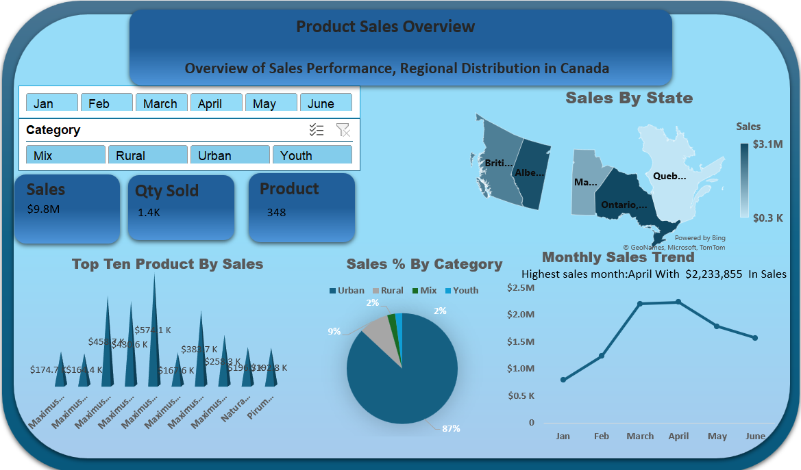

# 📊 Product Sales Overview Dashboard

A comprehensive Excel-based dashboard that provides actionable insights into product sales performance and regional distribution across Canada. This project showcases key Excel and Power Query skills in data cleaning, transformation, visualization, and KPI reporting.

---

## 🛠 Tools Used

- **Microsoft Excel**
- **Excel Power Query**
- **Bing Maps for Geo Visuals**
- **Pivot Tables & Charts**

---

## 🔍 Project Objective

To analyze and visualize sales data to identify:
- Top-performing products
- Regional sales distribution
- Monthly sales trends
- Category performance
- Key business metrics (KPIs)

---

## 🔧 Data Preparation

Performed in **Excel Power Query**:
- Removed duplicates  
- Promoted headers from row data  
- Cleaned column names  
- Ensured consistency in product and category names

---

## 📈 Visualizations & KPIs

### ✅ KPI Metrics:
- **Total Sales**: `$9.8M`
- **Total Quantity Sold**: `1.4K units`
- **Total Products Sold**: `348`
- **Highest Sales Month**: `April – $2.23M`

### 📊 Dashboard Visuals:
- **Bar Chart**: Top 10 Products by Sales  
- **Pie Chart**: Sales % by Category (Urban, Rural, Youth, Mix)  
- **Line Chart**: Monthly Sales Trend  
- **Map Chart**: Sales Distribution by State  
- **Slicers**: Dynamic filters by Month and Product Category  

---
### 📊 Dashboard


## 💡 Key Insights

- **Ontario** led all provinces in total sales.
- **Urban** category dominated sales with **87% share**.
- **April** was the most profitable month with **$2.23M** in sales.
- **Top-selling products** belonged mainly to the **Maximus** line.

---

## 💬 Recommendations

- **Focus Marketing on Urban Areas**: Given Urban category’s dominance, allocating more marketing resources to urban-focused campaigns can yield higher returns.
- **Inventory Planning for April**: April consistently delivers the highest sales — consider increasing inventory or launching seasonal promotions during this period.
- **Expand Product Offerings Similar to Maximus Line**: Products from the Maximus line perform best; analyzing what drives their appeal could inform new product development.
- **State-Level Campaigns**: Explore tailored promotions in top-performing provinces like Ontario to strengthen customer retention and upsell opportunities.

---

## 📂 Project Folder Structure

```plaintext
📁 Product-Sales-Dashboard/
├── 📊 Dashboard.png
├── 📄 README.md
└── 📂 Dataset/
    └── sales_data.csv
